# 🏥 MRI Image Verification System

A production-ready Next.js 14 application for verifying MRI images against a reference image using advanced image comparison techniques including perceptual hashing, pixel-level analysis, and cryptographic hash generation.

## ✨ Features

- **🔍 Advanced Image Comparison**
  - Perceptual hash (pHash) matching
  - Pixel-by-pixel comparison
  - Structural similarity analysis
  - Multi-metric weighted scoring

- **🔐 Cryptographic Hashing**
  - SHA-256 hash generation for verified images
  - Secure verification tokens

- **🎨 Modern UI/UX**
  - Drag-and-drop file upload
  - Real-time image preview
  - Progress indicators
  - Detailed similarity metrics
  - Responsive design

- **📊 Database Logging**
  - Supabase integration
  - Verification history tracking
  - Analytics-ready data structure

- **⚡ Performance Optimized**
  - Fast image processing with Jimp
  - Efficient buffer handling
  - Processing time tracking

## 🚀 Quick Start

### Prerequisites

- Node.js 18+ installed
- A Supabase account (free tier works)
- npm, pnpm, or yarn package manager

### Installation

1. **Clone the repository**
```bash
git clone <your-repo-url>
cd mrip-uzzle
```

2. **Install dependencies**
```bash
npm install
# or
pnpm install
```

3. **Configure environment variables**

Copy `.env.example` to `.env.local` and fill in your Supabase credentials:

```bash
cp .env.example .env.local
```

Edit `.env.local`:
```env
NEXT_PUBLIC_SUPABASE_URL=https://your-project.supabase.co
NEXT_PUBLIC_SUPABASE_ANON_KEY=your_anon_key_here
SUPABASE_SERVICE_ROLE_KEY=your_service_role_key_here

SIMILARITY_THRESHOLD=95
MAX_FILE_SIZE_MB=10
```

**Get Supabase credentials:**
1. Go to [supabase.com](https://supabase.com)
2. Create a new project
3. Navigate to Settings → API
4. Copy your project URL and keys

4. **Set up the database**

Run the SQL script in your Supabase SQL Editor:

```sql
-- Navigate to: Supabase Dashboard → SQL Editor → New Query
-- Copy and paste the contents of scripts/01-create-schema.sql
```

Or use the Supabase CLI:
```bash
supabase db push
```

5. **Add reference image**

Make sure `public/dataset/tumor.jpg` exists (it should be included in the repo).

6. **Start the development server**

```bash
npm run dev
```

Visit [http://localhost:3000](http://localhost:3000)

## 📖 How It Works

### Image Verification Flow

```mermaid
graph LR
    A[User Uploads Image] --> B[Frontend Validation]
    B --> C[API Endpoint]
    C --> D[Load Reference Image]
    C --> E[Generate SHA-256 Hash]
    D --> F[Advanced Comparison]
    F --> G[Calculate Metrics]
    G --> H{Similarity ≥ 95%?}
    H -->|Yes| I[Return Hash & Details]
    H -->|No| J[Return Error]
    I --> K[Log to Supabase]
    J --> K
    K --> L[Display Results]
```



### Comparison Algorithm

The system uses three comparison methods:

1. **Perceptual Hash (40% weight)**
   - Generates 256-bit hash from 32x32 grayscale image
   - Calculates Hamming distance between hashes
   - Robust against minor variations

2. **Structural Similarity (30% weight)**
   - Analyzes overall RGB difference
   - Tolerant to lighting variations
   - Measures image structure preservation

3. **Pixel Similarity (30% weight)**
   - Direct pixel-by-pixel comparison
   - 30-point tolerance per pixel
   - Counts matching pixels

**Overall Similarity** = Weighted average of all three metrics

### API Endpoint

**POST** `/api/verify`

**Request:**
```typescript
Content-Type: multipart/form-data
Body: {
  file: File (image)
}
```

**Response (Success):**
```json
{
  "success": true,
  "hash": "sha256_hash_string",
  "similarity": "98.45",
  "details": {
    "pixelSimilarity": "97.80",
    "perceptualSimilarity": "99.20",
    "structuralSimilarity": "98.35",
    "processingTime": "245ms"
  }
}
```

**Response (Failure):**
```json
{
  "success": false,
  "error": "Image does not match the reference",
  "similarity": "72.30",
  "details": {
    "pixelSimilarity": "70.15",
    "perceptualSimilarity": "75.80",
    "structuralSimilarity": "71.00",
    "threshold": 95,
    "processingTime": "198ms"
  }
}
```

## 🗄️ Database Schema

```sql
CREATE TABLE verifications (
  id UUID PRIMARY KEY DEFAULT gen_random_uuid(),
  filename TEXT NOT NULL,
  match_result BOOLEAN NOT NULL,
  hash TEXT NOT NULL,
  similarity_percentage DECIMAL(5,2),
  created_at TIMESTAMP DEFAULT NOW()
);
```

## ⚙️ Configuration

Edit `lib/config.ts` to customize:

```typescript
export const config = {
  similarityThreshold: 95,        // Minimum match percentage
  maxFileSize: 10 * 1024 * 1024, // 10MB
  referenceImagePath: "public/dataset/tumor.jpg",
  supportedFormats: ["image/jpeg", "image/jpg", "image/png", "image/webp"],
  imageProcessing: {
    resizeWidth: 512,
    resizeHeight: 512,
    quality: 90,
  },
}
```

## 🧪 Testing

Test images are provided in `/test_images`:

```bash
# Test with matching image
test_images/tumor.jpg       # Should match 100%

# Test with similar images
test_images/real.jpg        # High similarity
test_images/reall.jpg       # High similarity

# Test with different images
test_images/old.jpg         # Low similarity
test_images/last.jpg        # Low similarity
```

## 🚢 Deployment

### Vercel (Recommended)

1. Push your code to GitHub
2. Import project in Vercel
3. Add environment variables in project settings
4. Deploy

```bash
vercel --prod
```

### Environment Variables for Production

Make sure to set these in your deployment platform:
- `NEXT_PUBLIC_SUPABASE_URL`
- `NEXT_PUBLIC_SUPABASE_ANON_KEY`
- `SUPABASE_SERVICE_ROLE_KEY`
- `SIMILARITY_THRESHOLD` (optional)
- `MAX_FILE_SIZE_MB` (optional)

## 🛠️ Technology Stack

| Category | Technology |
|----------|-----------|
| **Framework** | Next.js 14 (App Router) |
| **Language** | TypeScript |
| **UI Library** | React 19 |
| **Styling** | Tailwind CSS |
| **Components** | Radix UI, shadcn/ui |
| **Image Processing** | Jimp |
| **Database** | Supabase (PostgreSQL) |
| **Authentication** | Supabase Auth (optional) |
| **Deployment** | Vercel |

## 📁 Project Structure

```
mrip-uzzle/
├── app/
│   ├── api/
│   │   └── verify/
│   │       └── route.ts          # Main verification API
│   ├── page.tsx                  # Frontend UI
│   ├── layout.tsx                # App layout
│   └── globals.css               # Global styles
├── components/
│   └── ui/                       # shadcn/ui components
├── lib/
│   ├── config.ts                 # App configuration
│   ├── supabase.ts               # Supabase client
│   └── utils.ts                  # Utility functions
├── public/
│   └── dataset/
│       └── tumor.jpg             # Reference image
├── scripts/
│   └── 01-create-schema.sql     # Database schema
├── test_images/                  # Test images
├── compute_hash.py              # Python hash generator
├── verify_mri.py                # Python CLI verifier
└── README.md
```

## 🐛 Troubleshooting

### "Reference image not found" error
- Ensure `public/dataset/tumor.jpg` exists
- Check file permissions
- Verify the path in `lib/config.ts`

### "Supabase connection failed" error
- Verify environment variables are set correctly
- Check Supabase project status
- Ensure database schema is created

### Image not matching expected results
- Check similarity threshold in config
- Verify reference image is correct
- Review comparison metrics in response details

### "File too large" error
- Compress your image
- Adjust `MAX_FILE_SIZE_MB` in `.env.local`

## 🔒 Security Notes

- Never commit `.env.local` to version control
- Use environment variables for all sensitive data
- Service role key should only be used server-side
- Implement rate limiting for production
- Add authentication for sensitive deployments

## 📝 License

MIT License - feel free to use this project for your needs.

## 🤝 Contributing

Contributions are welcome! Please follow these steps:

1. Fork the repository
2. Create a feature branch
3. Commit your changes
4. Push to the branch
5. Open a Pull Request

## 📧 Support

For issues and questions:
- Open an issue on GitHub
- Check existing documentation
- Review troubleshooting section

---

**Built with ❤️ using Next.js, TypeScript, and Supabase**
